# LinkedIn Prospector

Automated tool to find small tech companies, identify decision-makers and senior engineers, and send personalized LinkedIn connection requests.

## Setup

```bash
git clone git@github.com:ankitbhardwaj66/job-hunt.git
cd job-hunt

./run.sh --login   # First time: opens browser for manual LinkedIn login
```

**Required env var:**
```bash
export ANTHROPIC_API_KEY=your_key_here
```

**Google Sheets setup:**
1. Share your Google Sheet with `stock-screener@xirrledger.iam.gserviceaccount.com` (Editor)
2. Update `sheet_url` in `config.json`

---

## Usage

```bash
./run.sh                    # Search only, no connection requests
./run.sh --connect          # Search + auto-send connection requests
./run.sh --local            # Chandigarh mode (local companies only)
./run.sh --local --connect  # Chandigarh mode + auto-send
./run.sh --login            # Re-login if session expired
```

---

## Flow

```mermaid
flowchart TD
    A([Start Run]) --> PRE

    subgraph PRE["⓪ Pre-load from Google Sheet"]
        PA[Load all visited company slugs]
        PA --> PB[Load all contacted profile URLs]
    end

    PRE --> S1

    subgraph SEARCH["① Company Search"]
        S1[Pick current industry · save next index\nto .industry_state.json]
        S1 --> S2[Build faceted URL\ncompanySize=C · industryCompanyVertical=X]
        S2 --> S3[Paginate up to 10 pages]
        S3 --> S4{Company found?}
        S4 -->|yes| S5{Already in\nGoogle Sheet?}
        S5 -->|yes · skip| S4
        S5 -->|no| S6{Pass name filters?\nstealth · VC · recruiter\ncountry · placeholder}
        S6 -->|fail| S4
        S6 -->|pass| S7[Add to list]
        S7 --> S8{max_companies\nreached?}
        S8 -->|no| S4
        S8 -->|yes| DONE_SEARCH
        S4 -->|no more| DONE_SEARCH
    end

    DONE_SEARCH([For each company]) --> P1

    subgraph PEOPLE["② Find People"]
        P1[company/people/?keywords=\nmanager · cto · vp · head\npresident · chief · architect · senior]
        P1 --> P2[Click Show more up to 5×]
        P2 --> P3[Extract all visible people]
        P3 --> P5{More than\n10 candidates?}
        P5 -->|yes| P6[AI picks best 10\nfrom visible headlines]
        P5 -->|no| P7
        P6 --> P7[Candidate list ready]
    end

    P7 --> EACH([For each candidate]) --> PC1

    subgraph PROFILE["③ Profile Check"]
        PC1[Visit profile · get degree + location]
        PC1 --> PC2{Profile URL already\nin Google Sheet?}
        PC2 -->|yes| SKIP([Skip])
        PC2 -->|no| PC3{Open to Work\nbadge?}
        PC3 -->|yes| SKIP
        PC3 -->|no| PC4[Scroll · load Experience section\nfind title at THIS company]
        PC4 --> PC5{Freelance\nor past role?}
        PC5 -->|freelance| SKIP
        PC5 -->|past role| PC6[Fall back to headline]
        PC5 -->|current| PC7[Use experience title]
        PC6 --> PC8
        PC7 --> PC8{AI: what type?}
        PC8 -->|decision_maker\nCTO·VP·Manager·Architect| PC9[Continue]
        PC8 -->|senior_engineer\n8+ yrs backend/DevOps| PC9
        PC8 -->|skip| SKIP
        PC9 --> PC10{2+ activities\nin last 60 days?}
        PC10 -->|no| SAVE
        PC10 -->|yes| PC11[Generate message\ndecision_maker or senior_engineer style]
    end

    PC11 --> CN1

    subgraph CONNECT["④ Connect"]
        CN1{auto-connect\n& under limit?}
        CN1 -->|no| SAVE
        CN1 -->|yes| CN2[Find Connect button by name]
        CN2 --> CN3[Add note · send]
        CN3 --> SAVE
    end

    SAVE([Save to Google Sheet])
```



---

## Target Types & Messages

| Type | Who | Message style |
|------|-----|---------------|
| `decision_maker` | CTO, VP Eng, Engineering Manager, Tech Architect, Head of Eng | "I'm Ankit, backend/DevOps engineer, 10+ yrs exp... open to contract work. Let's connect!" |
| `senior_engineer` | Senior backend/DevOps/cloud engineer with 8+ yrs total exp | "I'm Ankit... if you're working on something interesting and need an extra hand on a contractual basis — I'm available." |

---

## How It Works

### Global Mode (`./run.sh --connect`)

**Target:** Small tech companies (11–50 employees) worldwide.

1. **Industry rotation** — each run searches one industry, saves index to `.industry_state.json`, picks the next one next run, loops. Reset by deleting the file.
2. **Company filters** — skips stealth companies, VCs, recruitment agencies, placeholders ("Startup"), companies with country names in the name, incubators, etc.
3. **People search** — hits `company/people/?keywords=manager,cto,vp,head,president,chief,architect,senior` to pre-filter by title keywords, then clicks "Show more results" up to 5× to load all matches.
4. **AI candidate selection** — if more than 10 people pass the exclude filter, Claude Haiku picks the best 10 based on visible headlines before any profile is visited.
5. **Profile + experience check** — visits each selected profile, scrolls to load the Experience section, finds the person's title **at this specific company**, then asks AI: decision-maker / senior engineer / skip?
6. **Activity check** — must have 2+ activities (posts, comments, reactions) in last 60 days.
7. **Personalized message** — generated by Claude AI, different for decision-makers vs senior engineers. Under 300 chars, no greeting, no emojis.
8. **Connection request** — finds the Connect button by person's name, adds note, sends.

### Local Mode (`./run.sh --local --connect`)

Same as global, plus:
- Adds `companyHqGeo` filter for Chandigarh (geo ID `104458930`)
- Message adapts: tricity people get local angle, others get remote angle

### What Gets Saved to Google Sheet

| Column | Description |
|--------|-------------|
| name | Clickable link to LinkedIn profile |
| company | Clickable link to company page |
| matched_role | Role label from AI (e.g. "cto", "senior devops engineer") |
| has_recent_activity | True if 2+ activities in 60 days |
| recent_activity_30d | Count of activities found |
| connection_degree | 1st / 2nd / 3rd |
| found_date | Date prospected |
| connect_sent | True / sent_no_note / False |
| local | yes / no |

Companies with no matching people get a `no_contact_found` row so they're skipped on the next run.

---

## Config

```json
{
  "industry_codes": ["96", "4", "6", "3", "48", "5", "2458"],
  "company_size_codes": ["C"],
  "max_companies_per_run": 15,
  "max_connects_per_company": 2,
  "skip_companies": ["Netsmartz"],
  "delay_between_actions": { "min_seconds": 3, "max_seconds": 8 },
  "delay_between_pages": { "min_seconds": 5, "max_seconds": 12 },
  "local_mode": {
    "location": "Chandigarh",
    "geo_id": "104458930"
  }
}
```

### Industry Codes

| Code | Industry |
|------|----------|
| `96` | IT Services and IT Consulting |
| `4`  | Software Development |
| `6`  | Technology, Information and Internet |
| `3`  | Technology, Information and Media |
| `48` | Computer and Network Security |
| `5`  | Computer Networking |
| `2458` | Data Infrastructure and Analytics |

To add more: LinkedIn company search → Industry filter → select → copy code from URL's `industryCompanyVertical` param.

To jump to a specific industry: set `{"last_index": N}` in `.industry_state.json` (0-indexed).

### Company Size Codes

| Code | Size |
|------|------|
| `B`  | 1–10 |
| `C`  | 11–50 |
| `D`  | 51–200 |

---

## Safety

- Random delays between all actions (3–12s)
- Real Chrome browser, not headless
- Automation flags hidden
- Session saved locally — no credentials in code
- Max 2 connects per company
- Never sends connect without trying to add a note first
- `Ctrl+C` safely saves whatever was collected before exiting
